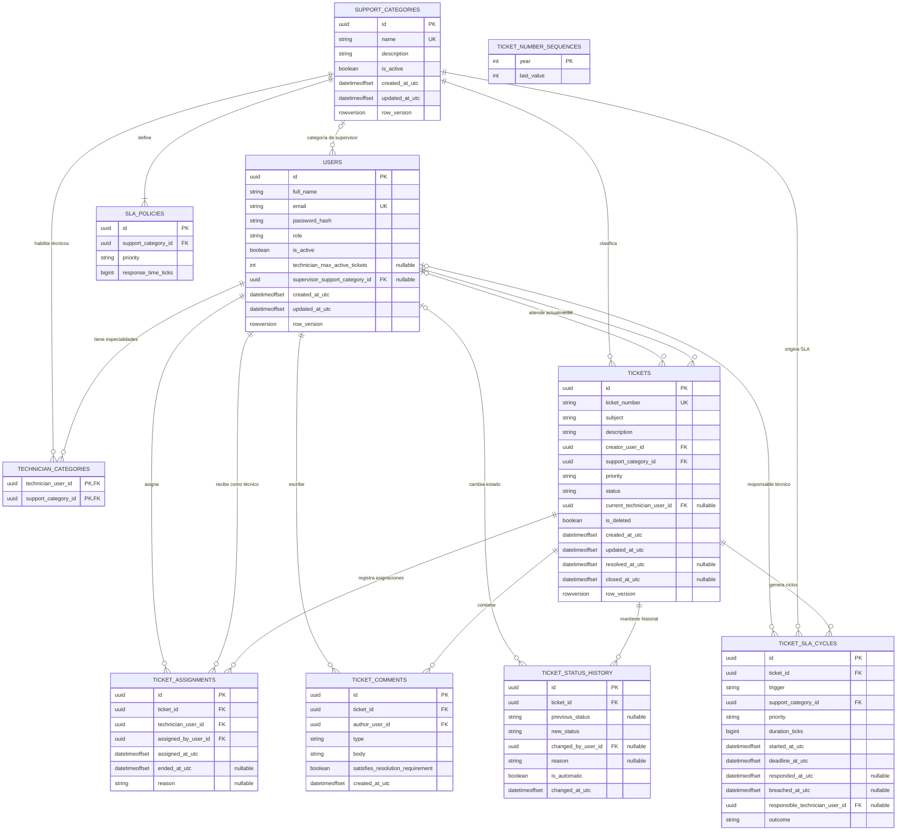

# Diagrama Entidad-Relación

## Sistema de Gestión de Tickets HelpDesk

El siguiente modelo representa las tablas persistidas por Entity Framework Core en SQL Server. Los perfiles de técnico y supervisor son objetos propios embebidos en `users`; el perfil de técnico posee una colección persistida en `technician_categories`.

## Relaciones principales

| Relación | Cardinalidad | Descripción |
|---|---:|---|
| `USERS` - `TICKETS` por `creator_user_id` | 1:N | Un usuario puede crear muchos tickets; cada ticket tiene un creador. |
| `USERS` - `TICKETS` por `current_technician_user_id` | 0..1:N | Un ticket puede tener técnico actual; un técnico puede atender varios tickets según su capacidad. |
| `SUPPORT_CATEGORIES` - `TICKETS` | 1:N | Cada ticket pertenece a una categoría activa. |
| `SUPPORT_CATEGORIES` - `SLA_POLICIES` | 1:4 o más | Cada categoría debe tener una política para cada prioridad: baja, media, alta y crítica. La unicidad se garantiza por categoría y prioridad. |
| `USERS` - `TECHNICIAN_CATEGORIES` - `SUPPORT_CATEGORIES` | N:M | Un técnico puede atender varias categorías y una categoría puede tener varios técnicos habilitados. |
| `TICKETS` - `TICKET_ASSIGNMENTS` | 1:N | Conserva el historial de asignaciones y reasignaciones. |
| `TICKETS` - `TICKET_COMMENTS` | 1:N | Conserva comentarios generales, de resolución y de justificación. |
| `TICKETS` - `TICKET_STATUS_HISTORY` | 1:N | Registra el flujo de estados y si el cambio fue automático. |
| `TICKETS` - `TICKET_SLA_CYCLES` | 1:N | Registra el SLA inicial y los ciclos posteriores asociados a reaperturas o cambios del flujo. |
| `USERS` - `TICKET_SLA_CYCLES` | 0..1:N | Un ciclo puede identificar al técnico responsable de la atención. |

## Reglas representadas en el modelo

- `users.role` determina el perfil. Los roles `User` y `SuperAdmin` no tienen perfil adicional.
- Un `Technician` requiere `technician_max_active_tickets` y al menos una fila en `technician_categories`.
- Un `Supervisor` requiere `supervisor_support_category_id`.
- `TICKET_COMMENTS.satisfies_resolution_requirement` permite comprobar que existe comentario de resolución antes del cierre.
- `TICKET_SLA_CYCLES.outcome`, `deadline_at_utc` y `breached_at_utc` permiten detectar vencimientos.
- `TICKET_STATUS_HISTORY.is_automatic` distingue transiciones realizadas por el sistema, como el vencimiento SLA.
- Las colecciones dependientes del ticket se eliminan en cascada al eliminar físicamente el ticket; el ticket usa además `is_deleted` y un filtro global para borrado lógico.
- Las relaciones con usuarios y categorías usan restricciones de no acción al eliminar para proteger la integridad histórica.

## Índices y restricciones relevantes

- Unicidad en `users.email`, `support_categories.name` y `tickets.ticket_number`.
- Unicidad compuesta en `sla_policies(support_category_id, priority)`.
- Clave compuesta en `technician_categories(technician_user_id, support_category_id)`.
- Índices de consulta para creador, técnico actual, categoría, estado y fechas de SLA.
- Restricciones de base de datos para capacidad positiva de técnicos y duración positiva de las políticas/ciclos SLA.
- `ticket_number_sequences` controla la numeración anual de tickets y no se relaciona por FK con el agregado `tickets` porque el número se materializa en `ticket_number`.

