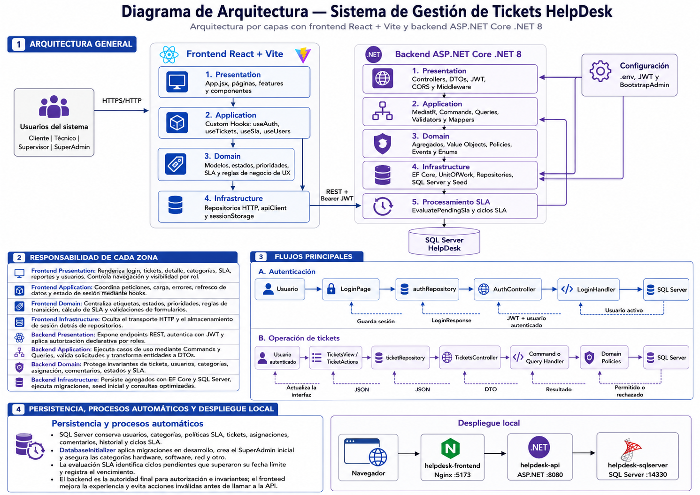
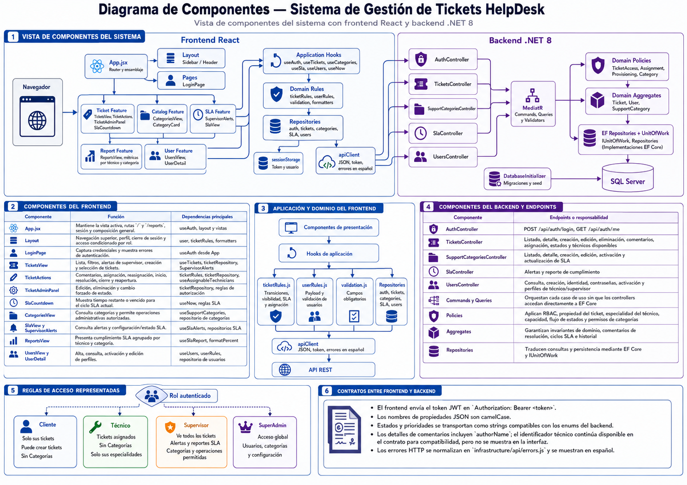
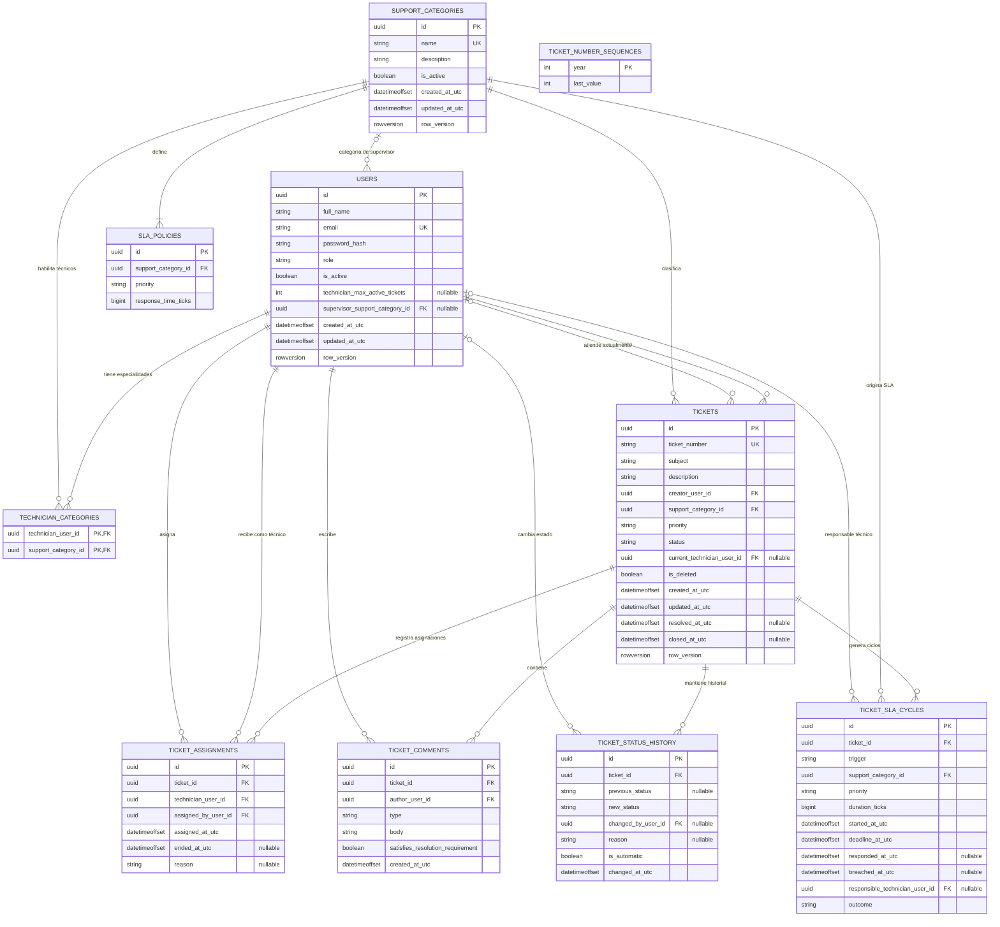

# HelpDesk

Sistema de gestión de tickets de soporte técnico para clientes internos, desarrollado con React, ASP.NET Core .NET 8 y SQL Server.

## Diagrama de arquitectura

La solución separa frontend, backend y persistencia. El backend aplica DDD, CQRS y una arquitectura por capas.



## Diagrama de componentes

Representa los componentes principales de React, los controladores y casos de uso del backend, y su comunicación mediante la API REST.



## Diagrama entidad-relación

El modelo conserva usuarios, categorías, tickets y sus historiales. Las reasignaciones, comentarios, cambios de estado y ciclos SLA se almacenan sin perder la trazabilidad.



Los técnicos pueden atender varias categorías mediante `technician_categories`. Cada categoría define un SLA por prioridad y cada ticket conserva sus asignaciones, comentarios, estados y ciclos SLA.

## Ejecución local

Requiere Docker Desktop.

1. Cree el archivo de variables de entorno y configure sus contraseñas:

   ```powershell
   Copy-Item .env.example .env
   ```

2. Levante frontend, API y SQL Server:

   ```powershell
   docker compose --profile frontend up --build -d
   ```

3. Abra:

   - Frontend: `http://localhost:5173`
   - Swagger: `http://localhost:8080/swagger/index.html`
   - SQL Server: `localhost,14330`

Los puertos pueden modificarse desde `.env`. Para detener los contenedores sin eliminar la base de datos:

```powershell
docker compose down
```
